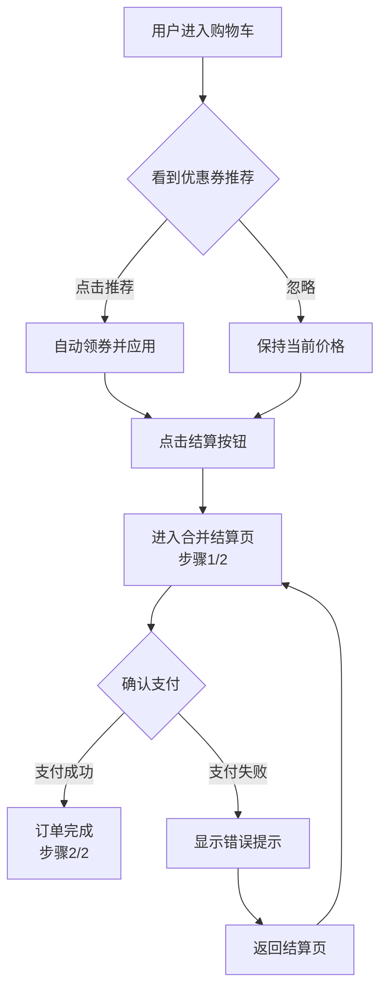

# PRD Assistant Examples

## Example 1: Shopping Cart Optimization

### Input

```
背景：当前购物车页面转化率仅12%，用户反馈结算流程太长需要4步
目标：将转化率提升到17%，结算流程缩减到2步
需求：
1. 购物车增加智能优惠券推荐
2. 结算流程合并步骤
3. 支持一键清理失效商品

业务流程：
1. 用户进入购物车 → 看到优惠券推荐卡片
2. 点击推荐卡片 → 自动领券并应用到订单
3. 点击结算 → 进入合并后的结算页（步骤1/2）
4. 确认支付 → 完成（步骤2/2）

目标用户：电商平台活跃用户
预期收益：转化率从12%提升到17%，预计带来GMV增长100万/月
上线时间：2025-04-15
```

### Output

✅ 需求价值完整



📋 功能清单（5项）

| 序号 | 功能模块 | 功能点 | 优先级 | 详细描述 | 验收标准 |
|------|---------|--------|--------|---------|---------|
| 1 | 购物车 | 智能优惠券推荐 | P0 | 根据购物车商品金额自动计算并推荐最优优惠券 | 推荐准确率>80%，展示位置醒目 |
| 2 | 购物车 | 一键领券应用 | P0 | 点击推荐卡片自动领券并实时应用到订单金额 | 领券成功率>95%，价格实时更新 |
| 3 | 购物车 | 失效商品清理 | P1 | 一键批量删除下架/无库存的失效商品 | 清理成功，有效商品保留，操作可撤销 |
| 4 | 结算 | 流程合并 | P0 | 将地址选择和支付方式选择合并为一步 | 结算步骤从4步减少到2步 |
| 5 | 结算 | 步骤指示器 | P1 | 顶部显示清晰步骤进度（步骤1/2） | 指示器显示正确，当前步骤高亮 |

📊 数据埋点

| 埋点事件 | 事件类型 | page | arg1 | 触发时机 | 关键参数 | 优先级 |
|---------|---------|------|------|---------|---------|--------|
| 购物车页面 | 2001 | /cart.lp.exposure | spm-cnt | 进入购物车页 | spm-cnt, spm-url, spm-pre | 必需 |
| 优惠券模块曝光 | 2201 | /cart.lp.exposure | page_cart_coupon_exp | 推荐卡片可见 | spm, _p_prod, _p_sku | 必需 |
| 优惠券模块点击 | 2101 | /cart.lp.click | page_cart_coupon_clk | 点击推荐卡片 | spm, spm-url, spm-pre, coupon_id | 必需 |
| 一键领券成功 | 2101 | /cart.lp.click | page_cart_claim_clk | 领券成功 | spm, _p_prod, coupon_id | 必需 |
| 领券失败 | 2101 | /cart.lp.click | page_cart_claim_fail_clk | 领券失败 | spm, coupon_id, error_code | 建议 |
| 失效商品清理 | 2101 | /cart.lp.click | page_cart_clear_clk | 点击清理按钮 | spm, clear_count | 建议 |
| 去结算点击 | 2101 | /cart.lp.click | page_cart_checkout_clk | 点击结算按钮 | spm, spm-url, spm-pre, item_count | 必需 |
| 结算页面 | 2001 | /checkout.lp.exposure | spm-cnt | 进入结算页 | spm-cnt, spm-url, spm-pre | 必需 |
| 支付成功 | 2101 | /checkout.lp.click | page_checkout_pay_clk | 点击支付 | spm, order_id | 必需 |

**埋点说明**：
- **字段命名**：所有埋点字段必须全部小写
- **page格式**：页面曝光使用 `/{lp}.lp.exposure`，点击使用 `/{lp}.lp.click`
- **SPM三件套**：页面事件(2001)必埋 spm-cnt/spm-url/spm-pre；曝光/点击(2201/2101)必埋 spm
- **商品卡必埋**：_p_prod(商品ID)、_p_sku(SKU ID)

📱 原型图

**页面1：购物车首页**
```
┌─────────────────────────┐
│  购物车(3)          编辑  │
├─────────────────────────┤
│ ┌────┐ 商品名称      ✓ │
│ │    │ 规格：红色     ○ │
│ │ 图 │ ¥99          + - │
│ │ 片 │               🗑 │
│ └────┘                  │
├─────────────────────────┤
│ ┌────┐ [已下架] 置灰   │
│ │    │ ¥0              │
│ │ 图 │               🗑 │
│ │ 片 │                  │
│ └────┘                  │
├─────────────────────────┤
│ ┌─────────────────────┐ │
│ │ 🎫 可省¥20  立即领取 │ │
│ └─────────────────────┘ │
├─────────────────────────┤
│  共2件  合计：¥198      │
│  [一键清理失效商品]     │
│       [去结算(2)]       │
└─────────────────────────┘
```
- 商品卡片：左图右信息，支持选择/编辑/删除
- 失效商品：置灰显示，不参与结算
- 优惠券卡片：显示可省金额，点击一键领取
- 底部栏：显示合计金额+结算按钮

**页面2：合并结算页**
```
┌─────────────────────────┐
│  <          确认订单    │
├─────────────────────────┤
│ 步骤 1/2                │
│ ████████░░              │
├─────────────────────────┤
│ 📍 收货地址             │
│ 张三 138****8888        │
│ 北京市朝阳区xxx街道     │
│ [更换地址]              │
├─────────────────────────┤
│ 🛒 商品清单             │
│ 商品1  x1    ¥99        │
│ 商品2  x1    ¥99        │
├─────────────────────────┤
│ 🎫 优惠券 -¥20          │
│ 💰 运费    ¥0           │
├─────────────────────────┤
│ 💳 支付方式             │
│ ○ 微信支付              │
│ ● 支付宝 (默认)         │
│ ○ 银行卡                │
├─────────────────────────┤
│  实付：¥178             │
│     [立即支付]          │
└─────────────────────────┘
```
- 步骤指示器：清晰显示当前进度
- 地址区：展示默认地址，支持更换
- 商品清单：展示结算商品
- 优惠明细：优惠券、运费分开显示
- 支付方式：单选，默认上次使用

---

## Example 2: Incomplete PRD (Value Check)

### Input

```
背景：用户反馈搜索功能不好用
需求：优化搜索体验
```

### Output

📋 需求价值补充追问：

1. **目标用户**：这个搜索优化面向所有用户，还是特定人群（如新用户/高频用户）？

2. **预期收益**：优化后预期带来什么？搜索转化率提升 / 用户满意度提升 / 搜索次数增加？

3. **收益量化**：当前搜索转化率是多少？预期提升到多少？或有什么定性目标？

4. **成功指标**：如何衡量搜索优化成功？核心指标是什么（如搜索点击率、无结果率）？

5. **上线时间**：预期什么时候上线？

6. **具体优化点**：搜索体验具体有哪些问题？需要优化哪些方面（如结果排序、筛选功能、搜索建议）？

请补充以上信息后，我将为您生成完整的功能清单、流程图、数据埋点和原型图。
